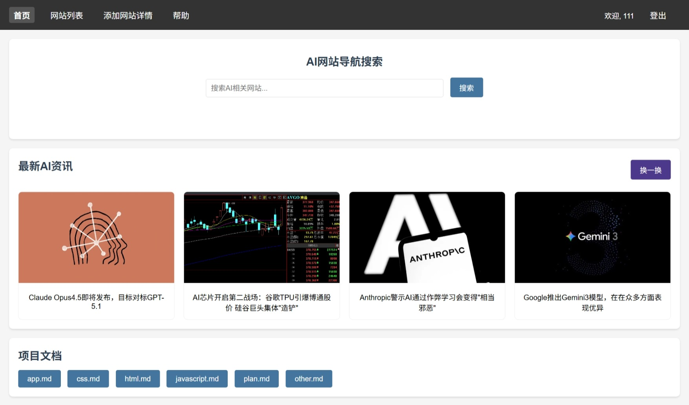
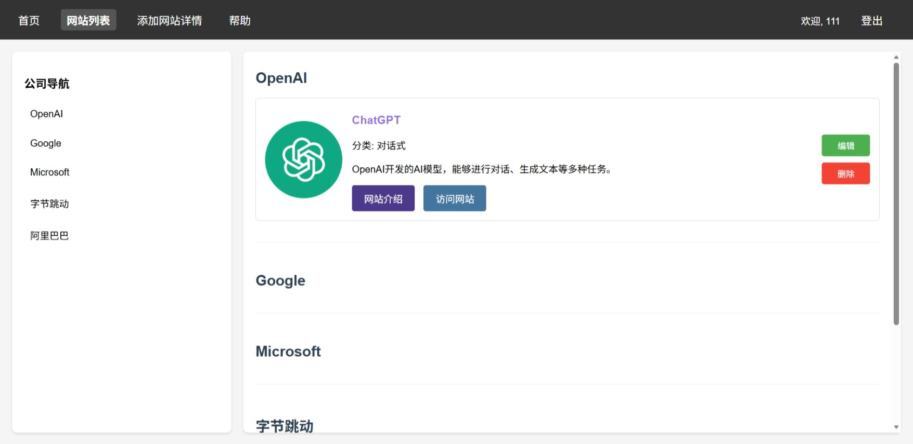
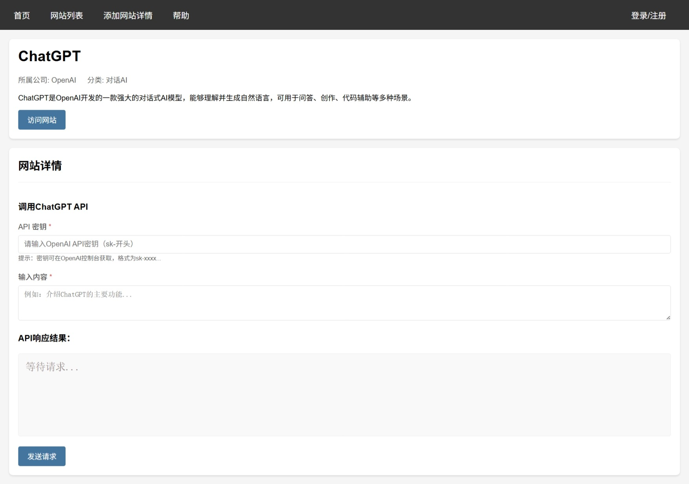
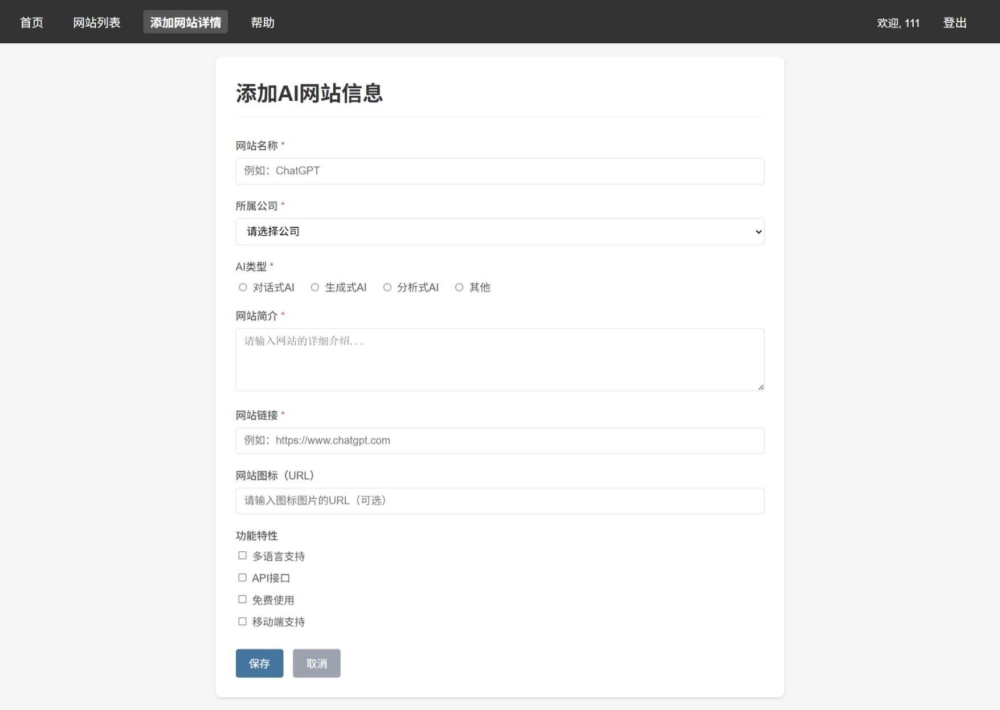
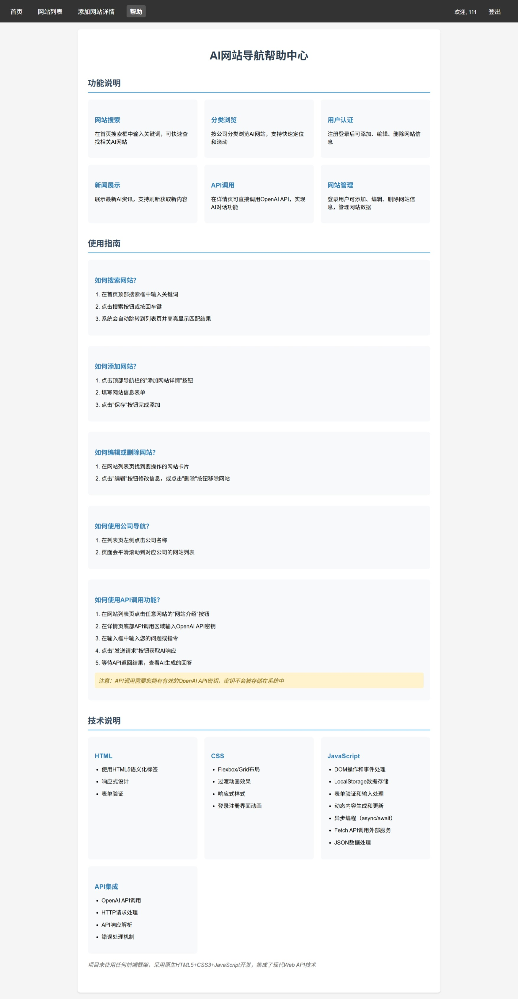
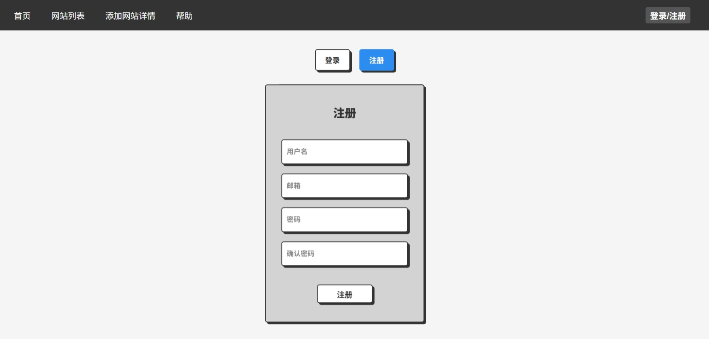

# 个人项目立项报告

## 网站概述

### 网站介绍
本网站是一个**AI产品导航平台**，专注于收集和展示国内外各大公司的AI产品，提供详细的产品介绍、使用教程和官方链接，帮助用户快速找到所需的AI资源。

### 个人特色
- **专注AI领域**：仅聚焦于AI相关产品，不涉及其他领域，内容更加专业和精准
- **信息全面**：每个产品包含名称、公司、描述、功能特点和简单API试用等多个功能
- **用户参与**：支持用户注册登录后添加新的AI产品信息，实现内容共建
- **响应式设计**：适配不同设备屏幕，提供良好的移动端体验

## 对标或参考的网站

- [迷鹿导航](https://www.plnav.com/)：参考其导航网站的整体结构和用户体验

## 内容来源和素材实例

### 内容来源
- 各AI公司官方网站信息
- 科技媒体报道和产品评测
- 用户注册后贡献的产品信息

### 素材实例

#### 素材1：ChatGPT
- **产品名称**：ChatGPT
- **所属公司**：OpenAI
- **AI类型**：对话AI
- **描述**：OpenAI开发的先进语言模型，能够进行自然语言对话、生成文本等多种任务
- **官方链接**：https://www.chatgpt.com
- **产品图标**：./images/list/ChatGPT-logo.webp

#### 素材2：Gemini
- **产品名称**：Gemini
- **所属公司**：Google
- **AI类型**：多模态AI
- **描述**：Google开发的多模态AI模型，支持文本、图像、音频、视频等多种输入
- **官方链接**：https://deepmind.google/technologies/gemini/
- **产品图标**：./images/index/Gemini3.png

#### 素材3：Claude
- **产品名称**：Claude
- **所属公司**：Anthropic
- **AI类型**：对话AI
- **描述**：Anthropic开发的AI助手，注重安全性和可解释性
- **官方链接**：https://www.anthropic.com/
- **产品图标**：./images/index/Claude Opus4.5.png

## 站点的组成页面

### 站点地图
```
├── 首页 (index.html)
├── 列表页 (list.html)
├── 详情页 (web_detail.html)
├── 添加AI页 (form.html)
├── 登录注册页 (login_register.html)
└── 帮助页 (help.html)
```

### 首页


### 网站列表页


### 网站详情页


### 添加网站页


### 帮助页


### 登录/注册页


### 导航结构
- **首页**：展示精选AI产品，提供搜索功能
- **列表**：按公司分类展示所有AI产品
- **添加网站**：用户提交新的AI产品信息
- **登录/注册**：用户认证功能
- **帮助**：使用指南和常见问题

### 关键组件
1. **导航栏**：提供网站主要页面的快速访问
2. **搜索框**：支持按产品名称、公司或描述进行搜索
3. **新闻图**：展示热门AI产品，吸引用户注意

## 控件类型

以产品详情页为例，分析网站包含的内容类型：

| 控件类型 | 用途 | 示例 |
|---------|------|------|
| 图片 | 展示产品logo或截图 | `` |
| 文本 | 产品名称、公司、描述等 | `<h1>ChatGPT</h1>` |
| 链接 | 指向产品官方网站 | `<a href="https://chat.openai.com/" target="_blank">访问官网</a>` |
| 列表 | 展示产品功能特点 | `<ul><li>自然语言理解</li><li>多轮对话</li></ul>` |
| 表单 | 添加新产品信息时使用 | `<input type="text" name="product_name">` |
| 按钮 | 提交表单、搜索等操作 | `<button type="submit">提交</button>` |
| 标签 | 标记产品类型 | `<span class="tag">聊天机器人</span>` |
| 导航菜单 | 网站页面导航 | `<nav><ul><li><a href="index.html">首页</a></li></ul></nav>` |

## 功能规划

### 核心功能
1. **产品详情**：点击产品卡片查看详细信息
2. **搜索功能**：支持关键词搜索AI产品
3. **分类浏览**：按公司分类浏览产品
4. **用户认证**：注册、登录功能
5. **产品添加**：登录用户可以添加新的AI产品

### 扩展功能（视时间和技术情况实现）
1. **产品编辑和删除**：登录用户可以编辑和删除自己添加的产品
2. **产品收藏**：用户可以收藏感兴趣的产品
3. **数据统计**：展示产品数量、用户数量等统计信息

## 技术实现

### 前端技术栈
- **HTML5**：页面结构和语义化标签
- **CSS3**：样式设计和响应式布局
- **JavaScript**：交互功能和动态效果
- **SCSS**：CSS预处理器，提高样式开发效率

### 数据存储
- 初始数据：JSON格式存储在JavaScript文件中
- 用户数据和新增产品：浏览器本地存储（localStorage）
